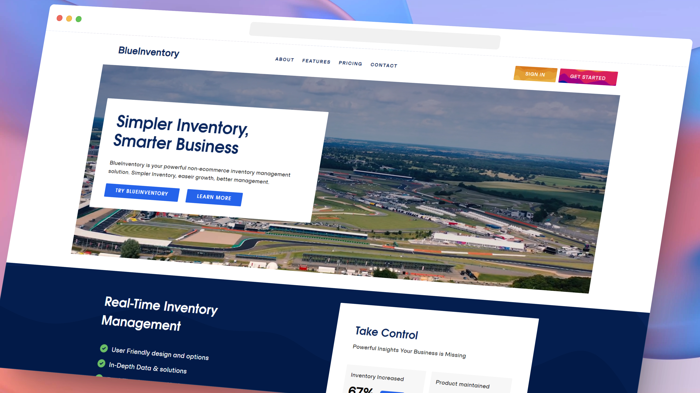

## Project Description

1. All images are in 4K resolution, click to enlarge for better viewing.

# Project Context
This is a Next.js 13 project Inventory Management SAAS (Software as a Service) Web App. A Typescript based project using nextjs 13 static-side & server-side rendering. This projects is developed with Next.js 13, Firebase, Stripe & Headless Wordpress API - featuring, Typescript, Javascript, React 18, Tailwind, and a Framer Motion Animation Library.

1. Develop a website using Next.js framework.
2. Learn Firebase as a BAAS (Back-end as a Service).
3. Show my ability to develope a headless-CMS, jamstack, Server Side Rendering & Firebase backend web application.

# My Objective
To further learn Firebase backen, fire cloud storage and Next.js 13 framework.

# Deployment

Deployed with vercel here: 

a). https://blueinventory.vercel.app/
